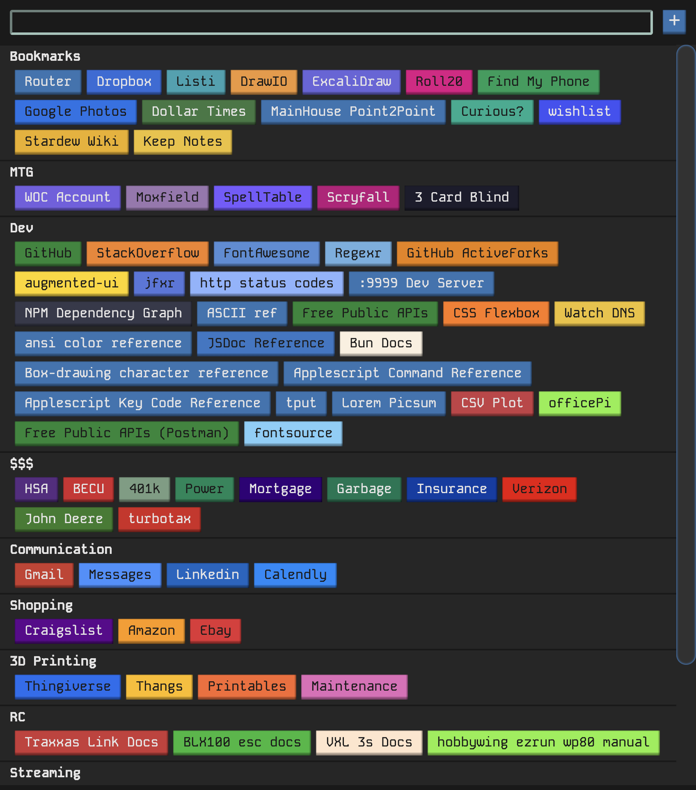

# home-page

A bookmark management web application with fuzzy search and configurable search engine integrations.



## Setup

Requires [Bun](https://bun.sh/).

```sh
bun install
```

## Run

```sh
# Production
bun start

# Development (hot reload)
bun run dev
```

## CLI Options

| Flag         | Alias | Default            | Description                    |
| ------------ | ----- | ------------------ | ------------------------------ |
| `--database` | `-d`  | `~/.homePage.json` | Path to the JSON database file |
| `--port`     | `-p`  | `8033`             | Server port                    |

## Build

```sh
bun run build          # One-off production build
bun run build:watch    # Watch mode for development
```

## Test

```sh
bun test
```

## Architecture

```
server/
  index.js              Entry point — CLI args, database init, seed, server start
  server.js             Bun.serve setup, WebSocket hot reload (dev)
  database/
    database.js         lowdb JSON persistence with serialized write queue
    crud.js             Generic CRUD factory with lifecycle hooks
    bookmarks.js        Bookmark model (beforeCreate/beforeUpdate: inline category creation)
    categories.js       Category model (afterDelete: cascade to bookmarks)
    searchEngines.js    Search engine model
  router/
    router.js           Main request router — delegates to entity routers + static
    bookmarks.js        /bookmarks CRUD endpoints
    categories.js       /categories CRUD endpoints
    searchEngines.js    /search/engines CRUD endpoints
    static.js           Static file serving with path traversal protection
  utils/
    requestMatch.js     Route pattern matching with parameter extraction
    search.js           Search provider execution — fetches external APIs per engine config
    defaultEngines.js   Seed data for search engines (Google, Stardew Wiki, Scryfall)

client/
  index.js              Entry — keystroke buffering before hydration, page mount
  context.js            Shared state (pre-render search buffer)
  router.js             SPA router
  build.js              Bun build script with watch mode
  api/                  Thin fetch wrappers with cache invalidation
  Bookmarks/            Main view — bookmark display, search, context menus, dialogs
```

## API

All endpoints accept and return JSON.

| Method   | Path                      | Description                                             |
| -------- | ------------------------- | ------------------------------------------------------- |
| `GET`    | `/bookmarks`              | List all bookmarks                                      |
| `POST`   | `/bookmarks`              | Create bookmark                                         |
| `GET`    | `/bookmarks/:id`          | Get bookmark                                            |
| `PATCH`  | `/bookmarks/:id`          | Update bookmark                                         |
| `DELETE` | `/bookmarks/:id`          | Delete bookmark                                         |
| `GET`    | `/categories`             | List all categories                                     |
| `POST`   | `/categories`             | Create category                                         |
| `GET`    | `/categories/:id`         | Get category                                            |
| `PATCH`  | `/categories/:id`         | Update category                                         |
| `DELETE` | `/categories/:id`         | Delete category (query: `moveTo` to reassign bookmarks) |
| `GET`    | `/search/engines`         | List search engines                                     |
| `POST`   | `/search/engines`         | Create search engine                                    |
| `GET`    | `/search/engines/:id`     | Get search engine                                       |
| `PATCH`  | `/search/engines/:id`     | Update search engine                                    |
| `DELETE` | `/search/engines/:id`     | Delete search engine                                    |
| `GET`    | `/search/:provider/:term` | Execute search with a configured engine                 |

### Bookmark creation with inline category

POST `/bookmarks` accepts `{ category: { create: { name: "New" } } }` to create a category inline during bookmark creation.

## Lint & Format

```sh
bun run lint
bun run format
```
